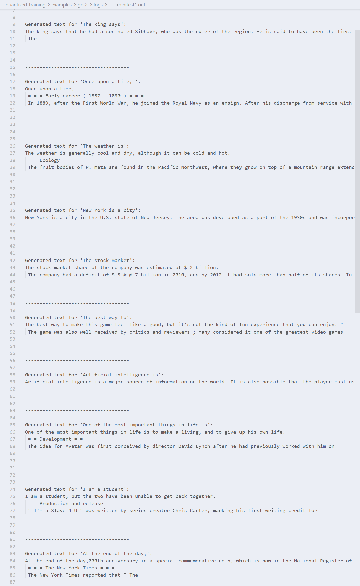
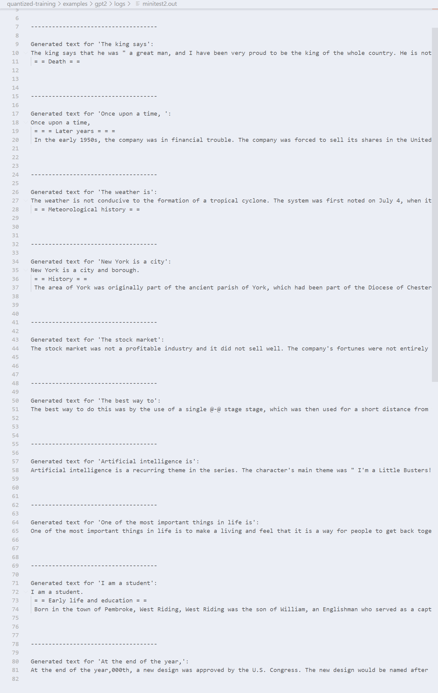

# Fudan AI Class Project

## Content
- [Fudan AI Class Project](#fudan-ai-class-project)
  - [Content](#content)
  - [Part1: Train a GPT2 from scratch](#part1-train-a-gpt2-from-scratch)
    - [环境配置](#环境配置)
    - [代码实现](#代码实现)
      - [quick start](#quick-start)
      - [训练过程](#训练过程)
      - [metric设置](#metric设置)
      - [自定义model](#自定义model)
    - [模型输出](#模型输出)
  - [Part2： Finetune our GPT2 using LoRA](#part2-finetune-our-gpt2-using-lora)
    - [环境配置](#环境配置-1)
    - [代码以及实验细节](#代码以及实验细节)
      - [使用LoRA进行大模型微调](#使用lora进行大模型微调)
        - [代码介绍](#代码介绍)
        - [实验步骤](#实验步骤)
        - [实验结果](#实验结果)
    - [说明](#说明)

## Part1: Train a GPT2 from scratch
本项目使用的框架来自于 **jeffreyyu0602/quantized-training (ASPLOS 2024)** [[link](https://github.com/jeffreyyu0602/quantized-training/tree/main)]

### 环境配置
- **Python Version:** Python 3.9 or newer.
- **PyTorch:** Version 2.3 or newer.

```bash
git clone https://github.com/jeffreyyu0602/quantized-training.git
cd quantized-training
```

```bash
conda create -n qt python=3.9
conda activate qt
conda install pytorch==2.3.1 torchvision==0.18.1 torchaudio==2.3.1 pytorch-cuda=<cuda_version> -c pytorch -c nvidia
pip install -r requirements.txt
pip install -e .
```
如果不先安装torch，直接安装requirements，可能会在安装的过程中卡住，原因未知。

### 代码实现
主要训练代码、训练日志、训练结果均放在quantized-training/examples/gpt2下，日志格式为tensorboard。
#### quick start
run a minitest
```bash
python quantized-training/examples/gpt2/minitest_gpt2.py
```

run a training program
```bash
python quantized-training/examples/gpt2/train_gpt2.py quantized-training/examples/gpt2/train_cfg.json
```
#### 训练过程
- 第一次训练时，采用train_cfg.json，设置模型结构为六个decoder堆叠，隐藏层输入宽度为768，并分解成12个注意力头（每个注意力头输入宽度为64），同时设置精度为float32
训练参数上，训练5个epoch，lr用的3e-4。
训练日志位于/quantized-training/examples/gpt2/train_logs，权重位于/quantized-training/examples/gpt2/output
查看log，发现loss稳定下降，认为还能继续训练（GPT好像都是这样的，不像CNN会震荡，很多论文也提到了这一点）
跑一个minitest，查看第一次训练结果（/quantized-training/examples/gpt2/logs/minitest1.out），结果看起来不太行。决定继续训练

- 第二次训练时，采用train_with_preWeight_cfg.json，继承第一次训练的权重，精度保持float32
训练参数上，继续训练5个epoch（共计10个epoch），lr用的3e-4。
训练日志位于/quantized-training/examples/gpt2/train_logs_e10，权重位于/quantized-training/examples/gpt2/output_e10
查看log，loss继续稳定下降，perplexity也显著降低。
跑一个minitest，查看第二次训练结果（/quantized-training/examples/gpt2/logs/minitest2.out），结果看起来似乎比第一次好一点。但是继续霍霍服务器的GPU不太好（smile），就这样吧。

#### metric设置
训练过程中会间隔一段时间进行一次evaluate，通过修改train_gpt2.py可以选择eval采用何种metric。但是在原版的仓库中，并没有本地化metric，而服务器不能联网，因此需要本地化metric
从hf的github库[[link]https://github.com/huggingface/evaluate]下载metrics，并将其放在/quantized-training/metrics目录下即可。

#### 自定义model
本项目支持自定义model结构，具体实现方式为在train_gpt2.py中使用同名覆盖的方法覆盖transformer中的GPT2
自定义的model放在/quantized-training/models/gpt2目录下
对应的代码在train_gpt2.py的第60-64行

### 模型输出
quantized-training/examples/gpt2/logs目录下存放了模型训练、测试、迷你测试的输出
本课程project要求的10条语句续写的输出是该目录下的minitest1.out和minitest2.out
- 第一次训练的权重的minitest结果
  
- 第二次训练的权重的minitest结果
  
可以看到10个epoch的weight相较于5个epoch的效果更好。（从训练过程的acc上升与loss降低，test的perplexity降低也说明看出10个epoch的训练效果好于5个epoch）


## Part2： Finetune our GPT2 using LoRA

本项目使用https://github.com/microsoft/LoRA/作为参考库。

### 环境配置

参考https://github.com/microsoft/LoRA/blob/main/examples/NLG/README.md中的配置方法。

1. 下载所有需要的python库，注意torch版本必须小于1.13.0

```bash
pip install -r requirments.txt
```

2. 下载数据集以及预训练权重，这里预训练权重用于和我们自己训练出来的GPT2模型作对比

```bash
bash download_pretrained_checkpoints.sh
bash create_datasets.sh
cd ./eval
bash download_evalscript.sh
cd ..
```

### 代码以及实验细节

#### 使用LoRA进行大模型微调

##### 代码介绍

1. beam test

在NLG/src中，gpt2_beam.py负责实现大模型的beam测试，在NLG/beam.sh中，用脚本实现了beam测试代码。

2. decoder

在NLG/src中，gpt2_decode.py负责实现对beam测试结果解码的工作。

3. Finetune

在NLG/src中，gpt2_ft.py负责实现对model.py中实现的llm模型的微调工作，对于GPT2来说，模型中的n_embd、n_layer、n_head是可以配置的。

4. 结果评估

eval/e2e/measure_scores.py实现了对decoder输出结果的评估，对于e2e数据集来说，评估标准为模型生成的句子和标准答案之间差距有多大。

##### 实验步骤

```bash
bash beam_hf_origin.sh # 对huggingface上的原始权重进行beam测试
bash beam_before_ft.sh # 对我们训练出的GPT2的原始权重进行beam测试
```

```bash
bash decode_hf_origin.sh # 对huggingface上的原始权重生成的结果解码
bash evaluation.sh > evaluation_hf_origin.log # 进行结果评估
bash decode_before_ft.sh # 对我们训练出的GPT2的原始权重生成的结果解码
bash evaluation.sh > evaluation_before_ft.log
```

```bash
bash ft_hg.sh # 对huggingface上的原始模型微调
bash ft.sh # 对训练出的GPT2的原始模型微调
```

```bash
bash beam_hf_ft.sh # 对huggingface微调后模型进行beam测试
bash beam_after_ft.sh # 对微调后的训练出的GPT2模型进行beam测试
```

```bash
bash decode_after_ft.sh
bash evaluation.sh > evaluation_after_ft.sh
bash decode_hf_ft.sh
bash evaluation.sh > evaluation_hf_ft.sh
```

##### 实验结果

|       model        |  BLEU  |  NIST  | METEOR | ROUGE_L | CIDEr  |
| :----------------: | :----: | :----: | :----: | :-----: | :----: |
|     hf_origin      | 0.0000 | 0.4170 | 0.0384 | 0.1638  | 0.0017 |
| custom_gpt2_origin | 0.0000 | 0.0590 | 0.0015 | 0.0000  | 0.0000 |
|    hf_finetune     | 0.6913 | 8.7298 | 0.4646 | 0.7140  | 2.5122 |
|   custom_gpt2_ft   | 0.3080 | 3.5745 | 0.1663 | 0.4115  | 0.3270 |

### 说明

* custom_gpt2 model: n_embd=768, n_layers=6, n_head=12
* hf_origin model: n_embd=1024, n_layers=24, n_head=16
* 由于checkpoints以及数据集太大，上传至网盘